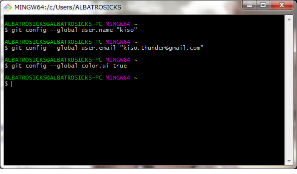
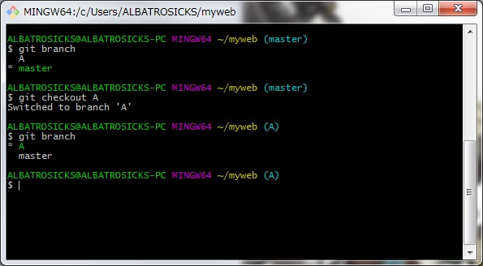

# Git とは #
## バージョン管理システム　##
・特徴

- 分散型バージョン管理システム
- ローカル操作

# 初期設定  #

- 作業ディレクトリ
- ステージングエリア　(インデックス)
- [リポジトリ](http://e-words.jp/w/%E3%83%AA%E3%83%9D%E3%82%B8%E3%83%88%E3%83%AA.html)　（ローカル　リモート）

[Gitのコマンド一覧](https://osdn.jp/magazine/09/03/16/0831212)

[Git bashのダウンロードサイト](https://git-for-windows.github.io/)

git config --global user.name “名前を入れる”

git config --global user.email “メールアドレス”

git config –-global color.ui true （おまじない）

git config -l 　(入力内容の確認)

##　実際に使ってみる　##

pwd カレントディレクトリの表示（現在位置）

mkdir フォルダの作成

cd　ディレクトリの変更

git init Gitでここのファイルを使用するぜ宣言

[コマンドモードでの操作](http://www.webhtm.net/vim/preserve.htm)

※ESCキーを二回押すと切り替わります。

vim 　ファイルの作成。今回はindex.htmlを作成します。

cat 　ファイル内容表示　

git add  作業ディレクトリからステージングエリアへ上げる

git commit ステージングエリアからリポジトリへ

git log コミットした履歴が出てきます

便利なlog確認
- git log --online １行に簡潔に表示

- git log -p 差分を表示

- git log --stat どこのどのファイルが変更されたか

###　更新してみる　###

index.htmlに"second　ver"と追加してみました。

git add と　git commit で更新

git logでは2回目の編集ログが出てきます。

git status 現在の状況を確認

modified：変更されたファイル

git add "ファイル名" そのまま更新

git checkout -- "ファイル名" 更新の取り消し

今回は取り消しを行ってみます

きちんと取り消されて最初のfirstのみになっています　やったね！

# 前回からの続き　#

## エディターを使わないコミット　##

git commit -m "追加内容など"

直前のコミットを取り消し（ちょっとした修正時など）

git commit --amend

## 過去のバージョンに戻る　##

今まで作ってきたファイルを任意のバージョンに戻すときに使います。

最初のバージョンを作成しました。

続いて２番めのバージョンにアップデートしてみました。

バージョンアップごとに数字を一つづつ追加してみました。

同じように4回目のバージョンアップを行いました。

addをした時点でミスなどがあり、修正したい場合は git reset --hard で 直前のバージョンに戻すことができます。

これで任意のバージョンに戻すことができます。（今回は直前のバージョン）

# ブランチ　#

ブランチ(=枝）は複数バージョンで開発を行う場合に便利です。

git branch "ブランチ名"　新たにブランチを作成

git checkout "ブランチ名" ブランチの切り替え

このようにブランチのスイッチングができました。

今回はブランチAにてmyscript.jsを作成してみます。

ログを見てみると

3rdまでの履歴の他に今回のコミット結果が表示されています。

ブランチを切り替えてmasterでもう一度ログを出力してみると

こちらの履歴には今回の更新は反映されていません。

## ブランチのマージ　##

派生したブランチをマスターのブランチと統合させたい場合はgit mergeを使用します。統合元に切り替えて

git merge "統合したいマージ"

すると統合をすることができます。確認してみると

このようにマスターにmyscript.jsが追加されています。

ブランチを削除する場合は git branch -d "削除したいブランチ名" で削除することができます。

